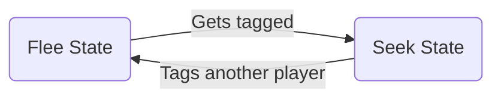

# Tag Game with Simple AI

## Game Overview
Simple game of tag between a player character and 9 AI characters in a fixed arena. The tagged character can pass on the tag to another character by touching them. When a character is tagged they are frozen momentarily before they can move again. While tagged the character's health gradually decreases however the characters speed increases, both effects are permenant. Last character standing wins.

## Installation and Use
Only the Unity script files are included in this repository therefore it is not possible to install and run the entire Unity project. However a playable version is available on my [itch.io](https://fraser-curry-games.itch.io/tag) page.

## Finite State Machine AI
The AI characters use a very simple FSM between two states depending on whether the AI is currently tagged:

### Seek State
Every frame the AI loops through the list of remaining characters on `GameManager`, finding the closest one and the relative direction towards it. The AI then moves along this direction to chase that character. If the closest character is the same as the previous frame, then the AI predicts the path of it's target by comparing the current and previous positions and moves to intercept the path.

### Flee State
Every frame the AI determines the direction and distance to the tagged character, initialising it's movement vector directly away from teh tagged character. We then add various weighted disturbances to this vector to make it perform both more intelligently and human-like:

#### Centering
Often the best way to escape the tagged character is to move to the opposite side of the arena rather than directly away. This disturbance vector is pointed to the opposite side and with a larger weight the further away the tagged character is. This behaviour is the most strategic and therefore human-like.

#### Wall avoidance
Without wall avoidance the AI character tends to continually press against every wall, slowing it self so much it always gets tagged. The AI performs 3 raycasts (forward, left and right) and adds a vector that steers it away from walls with a larger weight the closer the detected wall is.

#### Wandering
AI also has a slight wandering behaviour to mimic the indecision and impreciseness of a human player. The wander angle is also routinely flipped to improve this effect.
